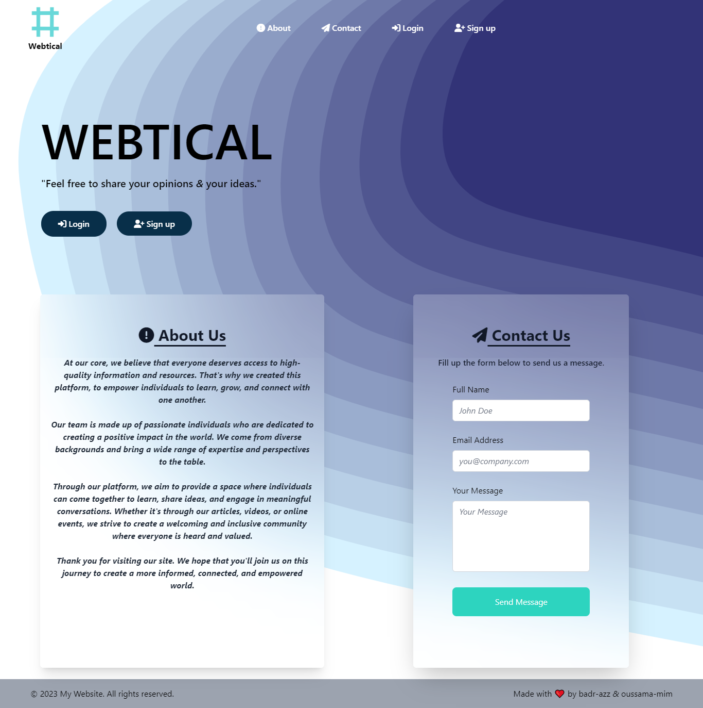
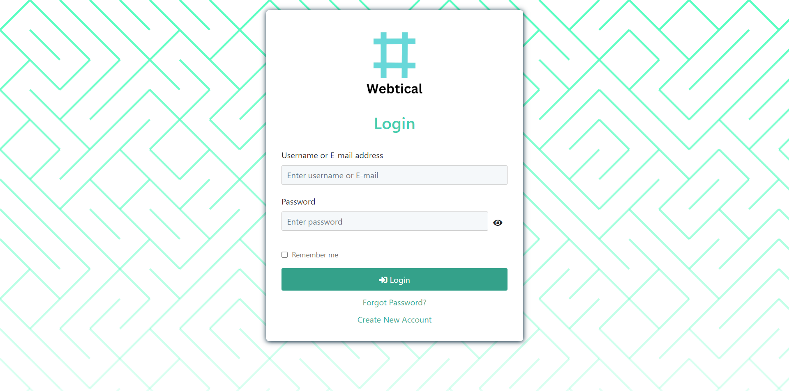
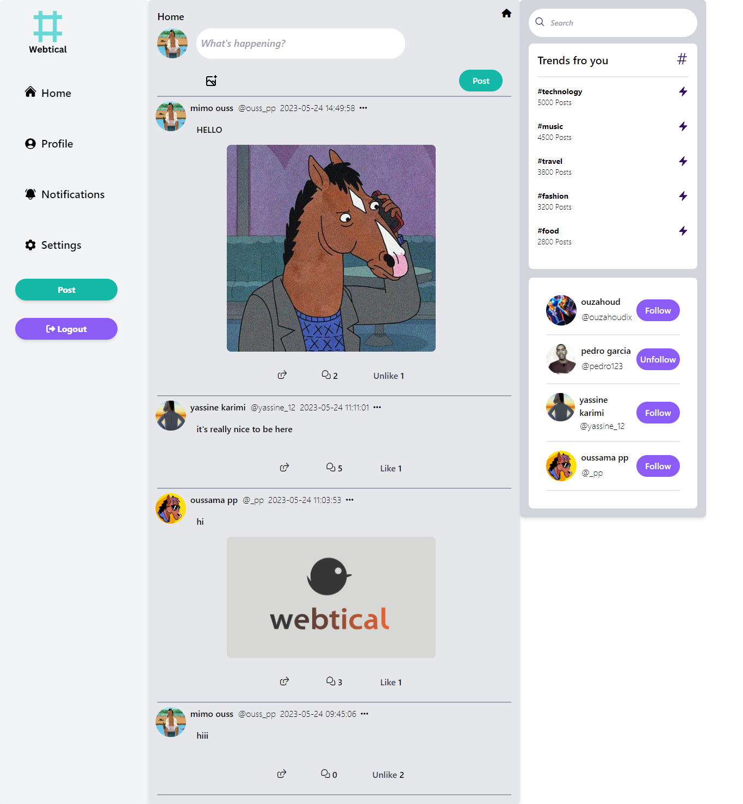
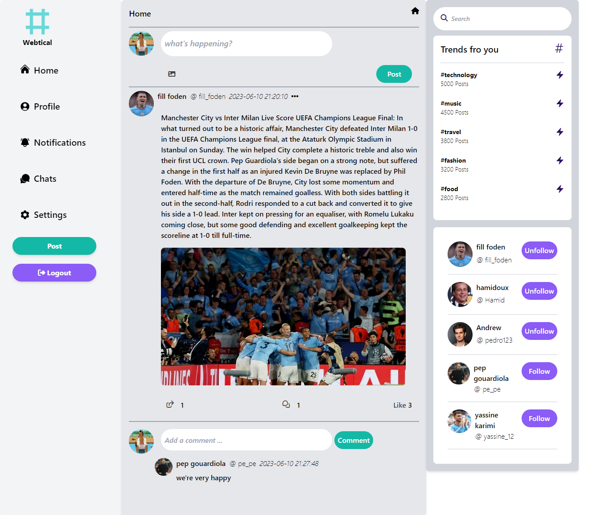
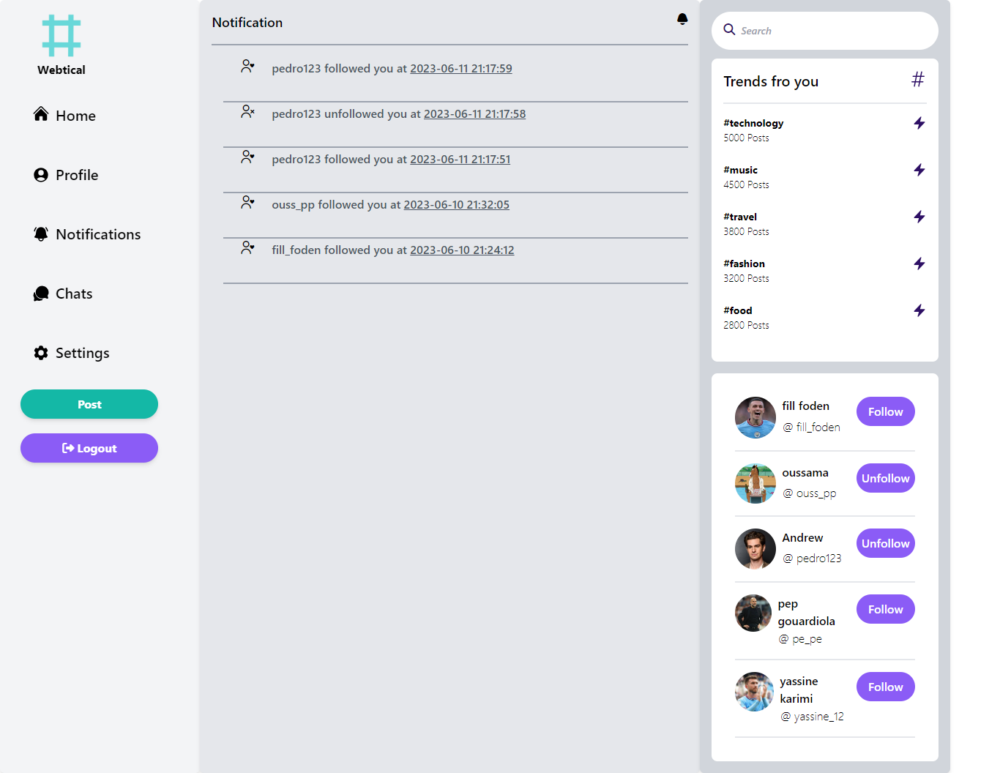
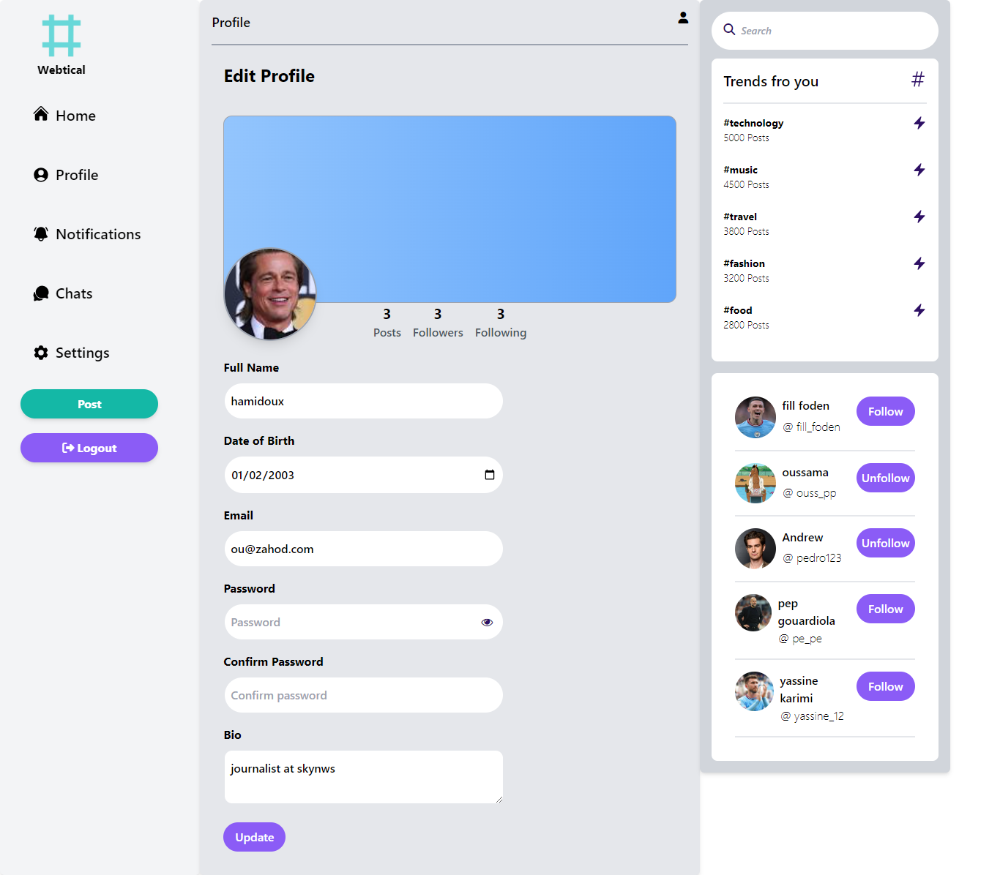
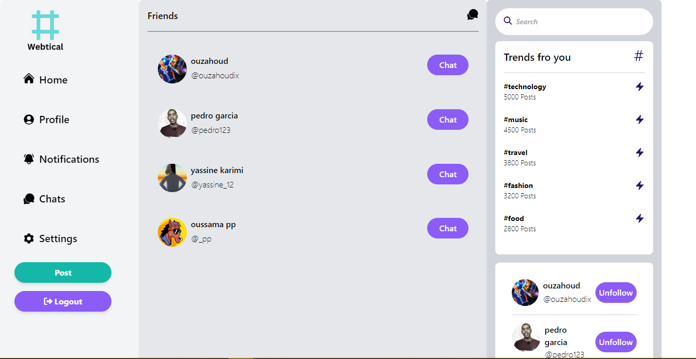
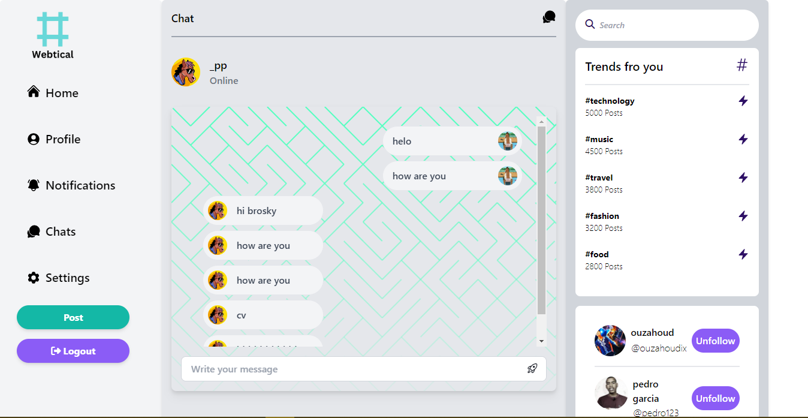

<h1>Webtical <em>V.1</em></h1>

Webtical is a dynamic and engaging social media platform designed to provide users with a space to freely share their opinions and ideas. With an array of exciting features, Webtical empowers users to express themselves through text and paragraphs, interact with posts through likes and comments, and connect with others by following their profiles. Stay updated and engaged with the platform's comprehensive notification system, ensuring you never miss out on the latest activity. Discover global trends and stay connected with the world through Webtical. This repository contains the codebase for the Webtical project, and by pushing it to GitHub, you can contribute to its development and make a positive impact on the social media landscape.

<h3>Credits</h3>

This guide was created by Oussama MIMOUNI & Badr AZZAGAGH.

<h3>index : </h3>

<h3>Sig nup : </h3>

<h3>Log in : </h3>

<h3>Home : </h3>

<h3>Posts && Comments : </h3>

<h3>Notifications : </h3>

<h3>Edit Profile : </h3>

<h3>Friends : </h3>

<h3>Chats : </h3>

